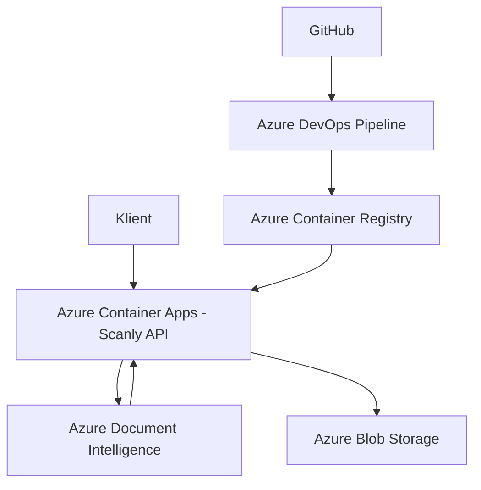

# Teknisk leveransrapport – Scanly

**Uppdrag:** Scanly AB – Fakturaigenkänning som tjänst  
**Konsult:** Kevin  
**Datum:** 2026-09-17  
**Version:** 1.0  

---

## Sammanfattning

Jag har byggt en molnbaserad lösning för Scanly där en användare kan ladda upp en faktura som PDF eller bild och få tillbaka strukturerad information från fakturan. Systemet använder Azure Document Intelligence för att läsa bland annat leverantör, fakturanummer, datum, belopp och radposter.

API:t körs i Azure Container Apps och resultatet från fakturaanalysen sparas som JSON i Azure Blob Storage. Jag använder även Docker, Azure Container Registry, Bicep och Azure DevOps Pipeline för att bygga och deploya lösningen.

---

## Vad som levereras

### Inkluderat i leveransen

| Komponent | Teknisk lösning | Status |
|---|---|---|
| REST API | .NET 10 Minimal API | Levererat |
| Containerisering | Docker multi-stage build | Levererat |
| Driftsättning | Azure Container Apps | Levererat |
| Container Registry | Azure Container Registry Basic | Levererat |
| Lagring | Azure Blob Storage | Levererat |
| AI-analys | Azure Document Intelligence, prebuilt-invoice | Levererat |
| Infrastructure as Code | Bicep | Levererat |
| CI/CD | Azure DevOps Pipeline | Levererat |
| API-dokumentation | Swagger | Levererat |

API:t innehåller följande endpoints:

- `POST /invoices`
- `GET /invoices/{id}`
- `GET /invoices`
- `GET /health`

När en faktura skickas till `POST /invoices` analyseras den med Azure Document Intelligence. Resultatet omvandlas till JSON och sparas sedan i Blob Storage.

### Utanför scope

Följande saker är inte implementerade i den nuvarande versionen:

- Inloggning och autentisering för kunder
- Application Insights
- Rate limiting
- Separata dev- och prod-miljöer
- En egen Document Intelligence-resurs för Scanly

Kursprojektet använder den delade Document Intelligence-tjänsten som tillhandahållits i kursen.

---

## Arkitektur

### Systemdiagram

Användaren laddar upp en faktura till API:t som körs i Azure Container Apps. API:t skickar dokumentet till Azure Document Intelligence som använder modellen `prebuilt-invoice`.

Document Intelligence skickar tillbaka den information som hittats i fakturan. Det kan till exempel vara leverantör, fakturanummer, fakturadatum, förfallodatum, totalbelopp, valuta och radposter.

Resultatet sparas sedan som en JSON-fil i Azure Blob Storage.

Koden ligger på GitHub. När kod pushas till `main` startar Azure DevOps Pipeline. Pipelinen bygger och testar projektet, bygger en Docker-image och pushar den till Azure Container Registry. Efter det uppdateras Container Appen med den nya imagen.

---

## Arkitekturval

### Azure Container Apps

Jag valde Azure Container Apps eftersom Scanly är ett ganska litet API och jag inte behöver administrera ett helt Kubernetes-kluster.

Jag kan fortfarande använda Docker-containers men Azure hanterar mer av infrastrukturen åt mig. Jag har konfigurerat minst två replicas för applikationen.

AKS hade gett mer kontroll men hade också gjort lösningen mer komplicerad än vad som behövs för det här projektet.

### Bicep

Jag använder Bicep för att beskriva infrastrukturen som kod.

I Bicep-filen finns bland annat:

- Storage Account
- Blob Storage
- Azure Container Registry
- Managed Identity
- Container Apps Environment
- Container App

Det gör att infrastrukturen kan versionshanteras tillsammans med resten av projektet.

Jag har också använt `az deployment group what-if` för att se vilka ändringar Azure tänker göra innan infrastrukturen deployas.

### Blob Storage

Jag valde Blob Storage eftersom varje analyserad faktura sparas som en mindre JSON-fil.

För den här lösningen behövs ingen mer avancerad databas. Blob Storage är enkelt och passar bra för det data som Scanly behöver spara just nu.

---

## Säkerhet

Jag använder Managed Identity för kommunikationen mellan Container Appen och flera Azure-resurser.

Container Appens identitet har rättighet att läsa Docker-images från Azure Container Registry och rättighet att läsa och skriva filer i Blob Storage genom RBAC.

Storage Accountet tillåter inte publik blob access och använder minst TLS 1.2.

### Document Intelligence

För Document Intelligence använder jag den API-nyckel som tillhandahållits i kursen.

Jag använder följande miljövariabler:

- `AZURE_DI_ENDPOINT`
- `AZURE_DI_KEY`

Endpointen ligger som en vanlig environment variable i Container Appen.

Själva API-nyckeln ligger som ett secret i Azure Container App och `AZURE_DI_KEY` refererar till detta secret. Nyckeln finns därför inte hårdkodad i `Program.cs` eller i GitHub.

Om en API-nyckel av misstag skulle hamna i Git behöver nyckeln bytas eller roteras och tas bort från Git-historiken.

### Kvarvarande risker

| Risk | Möjlig åtgärd |
|---|---|
| API:t saknar kundautentisering | Lägg till autentisering |
| Ingen rate limiting | Begränsa antal requests per kund |
| Delad Document Intelligence-resurs | Skapa egen resurs för produktion |
| Begränsad övervakning | Lägg till Application Insights |

---

## Kostnadskalkyl

Scanly tar enligt scenariot 299 kr per månad och kund.

Vid lansering räknar företaget med 30 kunder och ungefär 15 000 fakturor per månad.

Det ger en månadsintäkt på:

`30 × 299 = 8 970 kr`

Målet efter ett år är 200 kunder och ungefär 100 000 fakturor per månad.

Det ger:

`200 × 299 = 59 800 kr`

### Lansering

Jag räknar förenklat med ungefär en sida per faktura.

Document Intelligence är den största rörliga kostnaden eftersom kostnaden ökar beroende på hur många dokument eller sidor som analyseras.

Min uppskattning för lanseringen är ungefär:

| Azure-resurs | Ungefärlig kostnad per månad |
|---|---:|
| Document Intelligence | ca 1 500 kr |
| Container Apps | ca 100–300 kr |
| Azure Container Registry | ca 50–100 kr |
| Blob Storage | ca 10–30 kr |
| **Totalt** | **ca 1 650–1 900 kr** |

Med ungefär 15 000 fakturor per månad blir Azure-kostnaden ungefär:

`1 800 / 15 000 = 0,12 kr per faktura`

Det är en uppskattning och den verkliga kostnaden kan skilja sig beroende på bland annat antal sidor, trafik och resursanvändning.

### Mål efter ett år

Vid cirka 100 000 fakturor per månad uppskattar jag kostnaderna till ungefär:

| Azure-resurs | Ungefärlig kostnad per månad |
|---|---:|
| Document Intelligence | ca 9 800 kr |
| Container Apps | ca 300–800 kr |
| Azure Container Registry | ca 50–100 kr |
| Blob Storage | ca 30–100 kr |
| **Totalt** | **ca 10 200–10 800 kr** |

Med en intäkt på cirka 59 800 kr per månad är Azure-kostnaden fortfarande betydligt lägre än intäkten.

Detta tar däremot inte hänsyn till andra kostnader som personal, support, marknadsföring och skatt.

---

## Skalning

Den del som påverkas mest av en ökad mängd fakturor är Azure Document Intelligence eftersom varje ny faktura behöver analyseras.

Container Apps kan skala till fler instanser om trafiken ökar. Jag har konfigurerat minst två replicas och maximalt tre replicas i den nuvarande lösningen.

Blob Storage kan hantera betydligt mer data än vad projektet använder just nu och borde därför inte vara den första flaskhalsen.

Om antalet fakturor ökar kraftigt behöver jag främst hålla koll på kostnaden och begränsningarna för Document Intelligence samt om Container Appen behöver kunna skala till fler instanser.

---

## Rekommendationer inför produktion

Om Scanly skulle gå vidare till en riktig produktionsmiljö hade jag gjort några förbättringar.

Jag hade lagt till autentisering så att endast riktiga kunder kan använda API:t. Jag hade också lagt till rate limiting så att en kund inte kan göra obegränsat antal anrop på kort tid.

Application Insights hade varit bra för att kunna se fel, svarstider och annan information om hur systemet fungerar.

Jag hade även skapat separata utvecklings- och produktionsmiljöer och använt olika Bicep-parametrar för dessa.

I en riktig produktion hade Scanly också haft en egen Document Intelligence-resurs istället för den delade resursen som används i kursen.

Det hade även varit bra att sätta upp budget och kostnadslarm i Azure så att oväntat hög trafik inte leder till oväntat höga kostnader.

---

## Överlämning

| Leverabel | Plats |
|---|---|
| Källkod | `https://github.com/kevin-hermansson/scanly` |
| Bicep | `infra/main.bicep` |
| Dockerfile | `Dockerfile` |
| Azure Pipeline | `azure-pipelines.yml` |
| Arkitekturdokumentation | `ARCHITECTURE.md` |
| Kundrapport | `RAPPORT.md` |
| Swagger | `https://scanly-app.braveocean-2c55d0cc.swedencentral.azurecontainerapps.io/swagger` |

Lösningen är deployad i Azure och API:t har testats med en faktura där Document Intelligence lyckades läsa ut fakturainformation och radposter. Resultatet kunde sedan hämtas tillbaka från Blob Storage genom API:t.